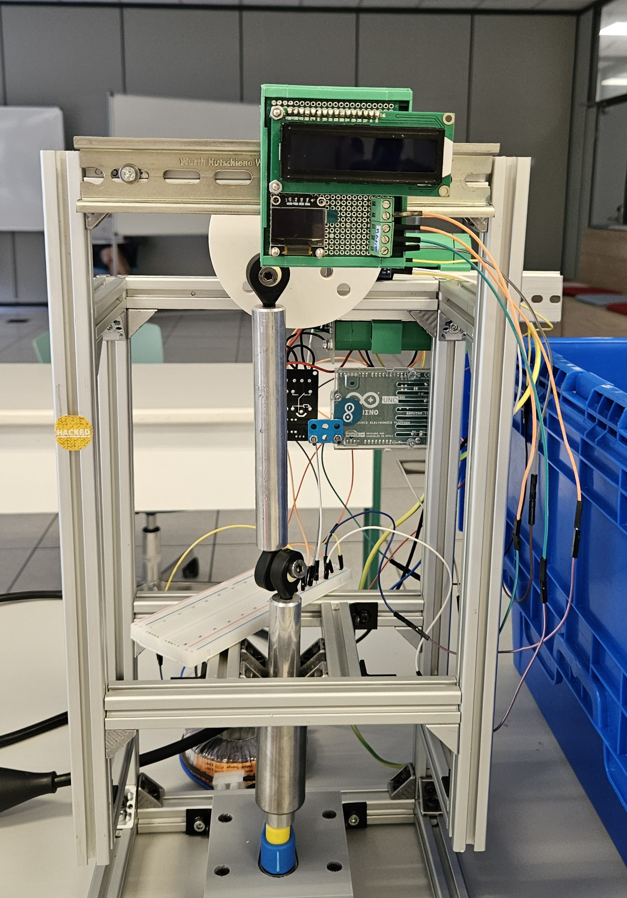
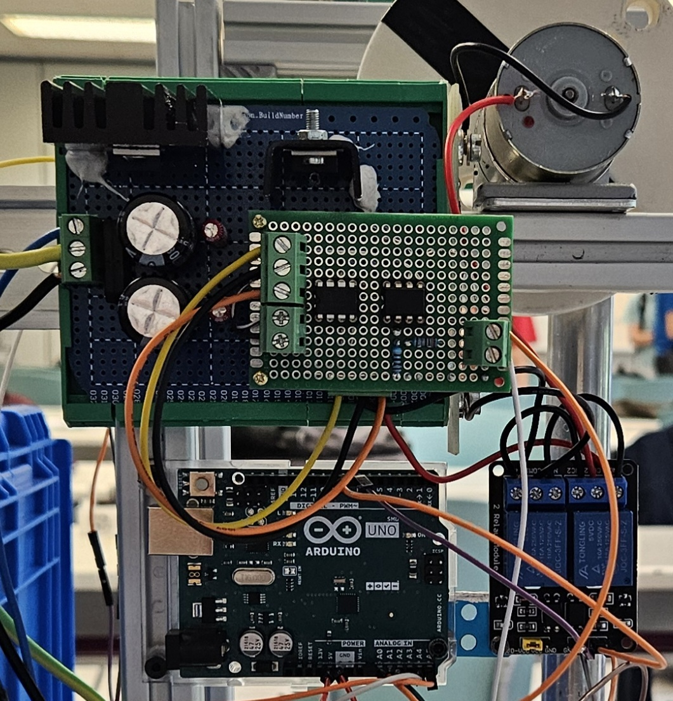
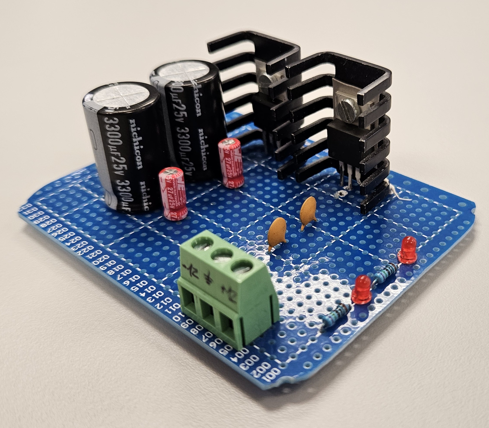
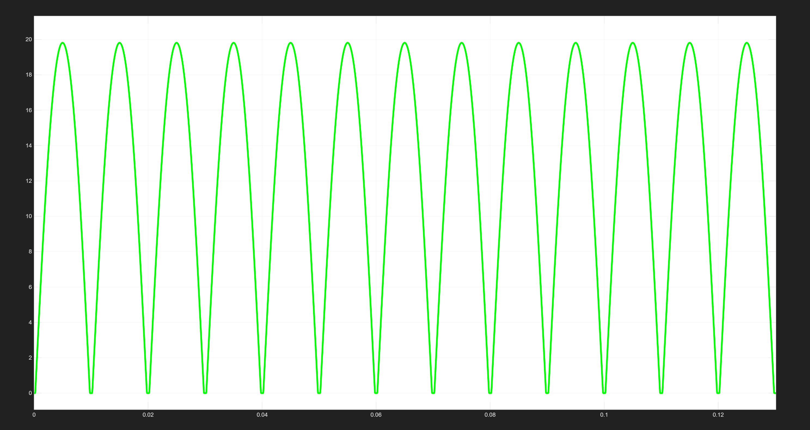
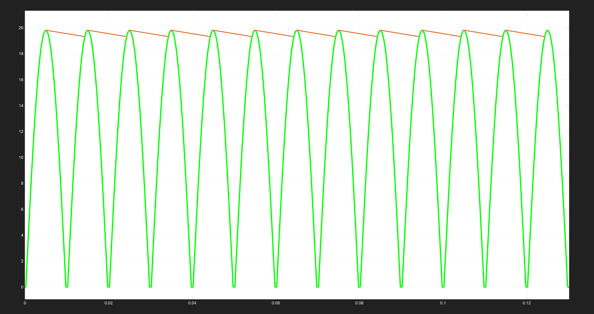
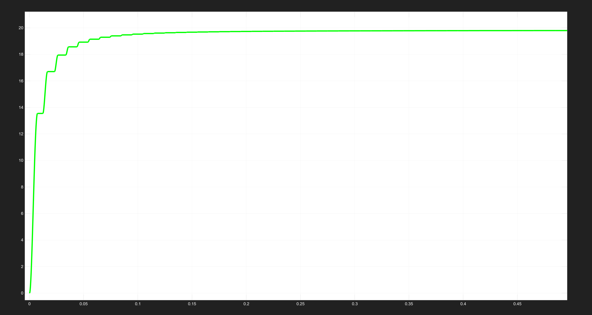
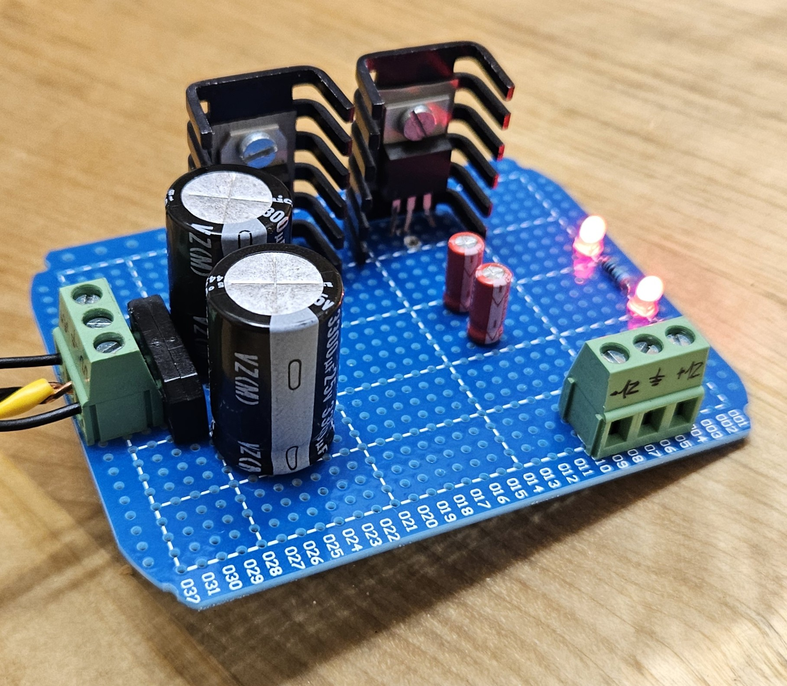

# Analog Signal Conditioning & Control - Scaled Punching Machine

This project covers the design, calculation, and implementation of the power supply that feeds a data acquisition and control system for a scaled industrial punching machine. The development focuses on the electrical and electronic hardware. It solves the problem of measuring a DC motor's current in a noisy environment using analog electronics and digital processing.

<p align="center">
  
  &nbsp;&nbsp;&nbsp;&nbsp;
  
</p>

## Project Context & My Role

This project was a multidisciplinary team challenge. The main objective was to design and build a fully functional, scaled prototype of an industrial punching machine. The project integrated several engineering fields:
* **Mechanical Design:** Creating the 3D model in SolidWorks and optimizing the structure.
* **Materials & Physics:** Studying cutting forces, shear strength, and calculating tool wear in MATLAB.
* **Signal Analysis:** Capturing and analyzing machine vibrations using Fourier Transforms (FFT) in MATLAB.
* **Electrical & Control:** Designing the power supply, analog conditioning circuits, and programming the microcontrollers.

### My Specific Contribution
To work efficiently as a group, we divided the tasks based on our technical strengths. **My role was to lead and develop the complete electrical, electronic, and control subsystems (which represented 90% of my personal workload in this project).**

While my teammates focused on the mechanical frames, material tests, and vibration analysis, I took full responsibility for the power delivery, analog circuit design, and Arduino programming. This portfolio documents my specific engineering work and decisions in these areas.

---

## 1. Project Overview

In industrial factories, monitoring motor current is very important to find machine faults and protect the system from overloads. The main goal of this project was to measure the real-time current of the punching machine's motor during its work cycle. In this case, the objective of measuring the current was to stop the machine if the power exceeds a safe limit. This current is read by an Arduino Uno R3, which controls a relay to switch the motor on or off. Additionally, the project required the possibility to change the motor's rotation direction. This specific part will be explained in broad strokes because it was a shared task with my team.

To do this, I designed and built an electronic system with three main parts:
* **Symmetric Power Supply:** A stable ±12V power supply. The +12V rail powers the DC motor and the positive analog rail, while the -12V rail is used for the negative analog rail of the operational amplifiers.
* **Signal Conditioning:** Reading the differential voltage from a shunt resistor and amplifying it so the microcontroller can read it and make control decisions based on this measurement.
* **Control Logic:** Processing the signal with an Arduino to monitor the machine and filtering the electrical noise using software.

---

## 2. Technical Specifications

It was selected the following hardware components and parameters to make the system accurate:

| System Component | Technical Specification | Primary Role |
| :--- | :--- | :--- |
| **Main Actuator** | 12V, 20W Brush DC Motor | Drives the mechanical system of the machine. |
| **Shunt Resistor** | 2A / 200mV 0.1Ω Shunt Resistor | Generates a small voltage drop proportional to the motor current. |
| **Analog Power Supply** | ±12V Symmetric power supply (regulated from 230V AC) | Provides clean power to the analog amplifiers and the motor. |
| **Differential Stage** | AMP03 Difference Amplifier | Reads the voltage across the shunt and removes common-mode noise. |
| **Gain Stage** | UA741CP Operational Amplifier | Is configured to amplifie the analog signal to a 0-5V range. |
| **Control Unit** | Arduino Uno R3 | Reads the analog signal and filters the noise using code. |

---

## 3. Symmetric Power Supply Design (±12V)

In this section is going to be shown the entire calculation, design and construction of the punching machine's power supply. 

<p align="center">
  
</p>

First of all is important to know that this power supply is different from standard ones. In this case, the power supply provides a +12/-12V, that makes a 24V of voltage drop. But, why is this configuration used instead of a +12V/0V one? With that configuration, the motor can be supplied with a 12V voltage and apparently the two op-amps too. 

Well, these op-amps, which are going to be introduced in the Section 4, are a common type known by the name of **non** rail-to-rail. This means that the op-amp output voltage can't be the same as the op-amp minimum supply voltage. Moreover, the voltage will never reach that minimum voltage because of the saturation voltage of these op-amps. Normally, this saturation voltage is about 1.5 and 2V, so, to get a 0-12V output from the amplifiers, a -2/12V power supply is needed.

### 3.1. Block Diagram & Operating Principle

To start understanding more about the power supply, it is necessary to know one difference. Generally, in our lives we use two types of power supplies. 

* **Linear DC power supply:** The simplest power supplies are the linear ones. These use transformers to reduce the AC voltage from the network. To convert that AC voltage into a DC one, a bridge rectifier is used, whose function is to make the AC sinusoidal wave a full positive sinusoidal wave.

<p align="center">
  
</p>

With that wave, a capacitor can cover the gap between the waves, getting rippled DC voltage.

<p align="center">
  
</p>

To get the pure DC signal, linear voltage regulators are used, these are dynamic resistors that dissipate excess voltage as heat, maintaining a constant output despite input or load variations.

<p align="center">
  
</p>

The inconvenience of this type is that all the excess voltage is dissipated as heat. The dissipated power is defined by the equation $P = \Delta V \cdot I$. So, if the required output voltage is 12V and the input voltage is about 19V defined by the output of the rippled capacitor and the connected load consumes about 1A, the dissipated power as heat is going to be:

$$P = (19 - 12) \cdot 1 = 7\text{W}$$

* **Switching DC power supply:** They are the modern ones, allow the user to reach high output powers generating low heat dissipation. they are the most used power supplies, from the PC's power supply to a electric car one.  I could go on and on explaining these ones but that could be enough for another article, so, what type has been chosen in this project?

The chosen one is the linear DC power supply because of its simplicity and the low noise generated. The switching ones, are more complex to understand and emit much noise compared to the linear ones.

### 3.2. Component Selection & Calculations

To build a reliable system, the physical power supply was assembled designed for constant and high-stress operation. This means that all the chosen components have been oversized to promise a long working time. This section explains which components were selected and why, along with some calculations for the oversizing.

<p align="center">
  
</p>

#### Power Calculations & Regulator Selection

The component selection was driven by the power requirements of the main actuator, the 12V, 20W brush DC motor. 

The nominal current consumed by the motor is theoretically calculated as follows:

$$I_{\text{nominal}} = \frac{P}{V} = \frac{20\text{ W}}{12\text{ V}} \approx 1.67\text{ A}$$

However, during physical testing in the laboratory, it was measured a diferent current consumption of the motor under different loads.
* **No-load current ($I_{\text{no-load}}$):** Measured between 0.2A and 0.3A when running freely.
* **Stall current ($I_{\text{stall}}$):** Measured at 2.19A when the motor is completely blocked (representing the absolute worst-case scenario if the punch gets mechanically blocked).

While a standard 1A or 1.5A regulator can be seem sufficient for the nominal operating conditions, it would immediately fail during a mechanical block event. 
For this reason, it was selected the following regulators:

* **LM1085IT-12 (+12V Rail):** This is a Low Dropout regulator rated for up to 3A. It provides a reliable safety margin even under the worst-case stall conditions:

$$\text{Safety Margin} = \frac{3\text{ A}}{2.19\text{ A}} \approx 1.37$$

This means that even if the mechanical punch gets completely blocked and the motor stops consuming 2.19A, the regulator still operates with a 37% safety margin. This prevents the regulator from failing, keeping the control electronics alive and giving the Arduino enough time to detect the current spike. A passive aluminum heatsink was also paired with it to manage the heat generated during these continuous load periods. The dimension and characteristics of the heatsink they weren't calculated because of the current safety margin.

* **7912 (-12V Rail):** Since the negative rail is dedicated exclusively to powering the operational amplifiers (UA741CP and AMP03), the current demand on this side is extremely low (typically under 10mA). A standard 1A negative regulator was selected. Because the actual load is less than 1% of the regulator's limit, it operates under no thermal stress and runs completely cool.

#### Filtering and Decoupling Stage

To ensure a clean DC output and shield the sensitive analog signals from motor noise, we implemented a filtering stage in the power supply. This design relies on the teamwork between different capacitor technologies, placing them in a specific electrical and physical order.

##### Ripple Voltage Calculation

The main filtering is compound by the large electrolytic capacitors ($3300\,\mu\text{F}$). To justify this capacity mathematically and ensure the voltage regulators never drop out of regulation, we calculate the peak-to-peak ripple voltage ($V_{r(pp)}$) using the full-wave rectified linear approximation:

$$V_{r(pp)} = \frac{I_L}{f \cdot C}$$

Where:
* $I_L$ is the nominal motor current load ($1.67\text{ A}$).
* $f$ is the ripple frequency ($100\text{ Hz}$ for a full-wave rectified $50\text{ Hz}$ mains grid).
* $C$ is the filtering capacity ($3300\,\mu\text{F} = 3300 \cdot 10^{-6}\text{ F}$).

$$V_{r(pp)} = \frac{1.67\text{ A}}{100\text{ Hz} \cdot 3300 \cdot 10^{-6}\text{ F}} \approx 5.06\text{ V}$$

Since our unregulated peak voltage ($V_{\text{peak}}$) is approximately $19\text{ V}$, the minimum instantaneous voltage ($V_{\text{min}}$) feeding the regulator input during the discharge phase is:

$$V_{\text{min}} = V_{\text{peak}} - V_{r(pp)} = 19\text{ V} - 5.06\text{ V} = 13.94\text{ V}$$

The LM1085 LDO regulator requires a minimum input voltage defined by its regulated output plus its dropout voltage ($V_{\text{dropout}} \approx 1.3\text{ V}$):

$$V_{\text{in(min)}} = V_{\text{out}} + V_{\text{dropout}} = 12\text{ V} + 1.3\text{ V} = 13.3\text{ V}$$

Because $13.94\text{ V} > 13.3\text{ V}$, this calculation mathematically proves that the input voltage will never drop below the regulator's minimum threshold, ensuring a completely stable and noise-free $12\text{ V}$ output.

##### Capacitor Teamwork and Order

While the $3300\,\mu\text{F}$ capacitors handle the heavy lifting of smoothing the low-frequency $100\text{ Hz}$ ripple, they are physically too slow to react to high-frequency electromagnetic interference (EMI) generated by the DC motor brushes. To solve this, we placed smaller, faster capacitors in a strict cascading order:

```text
[Rectifier Bridge] ──> [3300µF (Bulk)] ──> [100nF (Ceramic)] ──> [ Regulator ] ──> [27µF (Electrolytic)] ──> [Load]